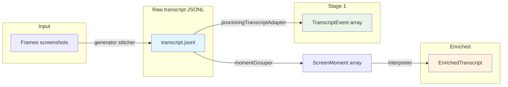
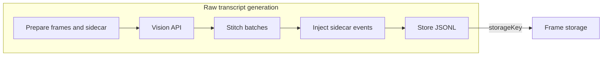
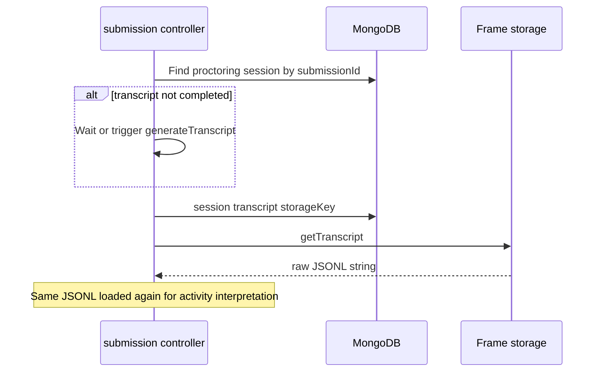
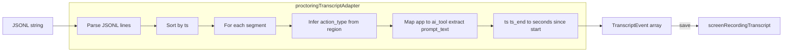
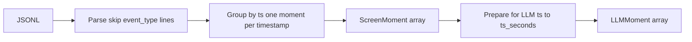
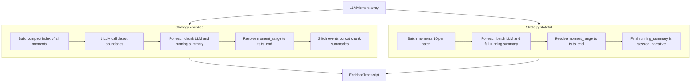
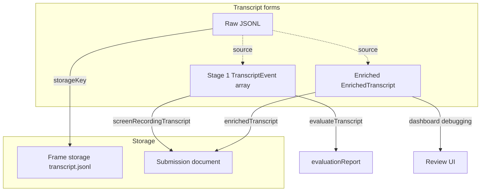

# How We Process the Raw Transcript

This document explains how the **raw** screen-recording transcript (VLM JSONL) is produced and then processed into the forms used for evaluation and behavioral insights.

---

## Overview

- **Raw transcript**: One JSON object per line; direct output of the vision pipeline (plus sidecar events). Stored in frame storage as `{sessionId}/transcript.jsonl`.
- **Stage 1 transcript**: `TranscriptEvent[]` with `action_type`, `ts`, `description`, etc. Stored on `Submission.screenRecordingTranscript`. Used by the **evaluation** pipeline (criteria scoring).
- **Enriched transcript**: Behavioral events and session narrative from the activity interpreter. Stored on `Submission.enrichedTranscript`. Used for richer review and debugging.

---

## 1. Where the raw transcript comes from

The raw transcript is **generated** from captured frames (and optional video chunks), not from a pre-existing text source. See `server/src/ai/transcript/generator.ts` and the pipeline doc for the full flow. In short:

1. **Prepare**: Load session frames (or extract from video), load sidecar events (blur/focus/copy/paste, etc.).
2. **Vision**: Frames are batched and sent to the vision model (GPT-4o-mini). The model returns JSONL lines describing what it sees per region (`ts`, `region`, `text_content` or `description`, `app`, etc.).
3. **Stitch**: Batch outputs are merged into one chronological JSONL (`server/src/ai/transcript/stitcher.ts`). Each line is a segment with at least `ts` and either `text_content` or `description`.
4. **Inject**: Sidecar events are injected into the JSONL timeline (`manifestInjector`). Those lines use `event_type` (e.g. `window_blur`) and are skipped when we build screen moments for interpretation.
5. **Store**: The final JSONL string is written to frame storage at `{sessionId}/transcript.jsonl`. The proctoring session document is updated with `transcript.status = "completed"` and `transcript.storageKey`.

So “raw transcript” here means: **the stored JSONL file** produced by this pipeline (vision + stitch + sidecar injection).

---

## 2. Loading the raw transcript

After submission, the backend runs `ensureProctoringTranscriptAndEvaluate(submissionId)` (in `server/src/controllers/submission.ts`). It:

1. Finds the proctoring session for that submission.
2. If needed, waits for or triggers transcript generation so the session has `transcript.status === "completed"` and a `transcript.storageKey`.
3. Loads the raw JSONL from storage via `getFrameStorage().getTranscript(session.transcript.storageKey)`.

The same raw JSONL is later reloaded for activity interpretation via `loadRawJsonlForSubmission(submissionId)`, which again uses the session’s `transcript.storageKey` and frame storage.

---

## 3. Processing the raw transcript into Stage 1 (TranscriptEvent[])

Stage 1 is the transcript format used for **evaluation** (criteria scoring). It is produced from the raw JSONL by `server/src/services/evaluation/proctoringTranscriptAdapter.ts`.

### 3.1 Parse JSONL into segments

- Split the JSONL string by newlines, trim, strip markdown code fences if present.
- For each line: parse JSON; keep only objects that have `ts` and either `text_content` or `description`. Discard malformed lines.
- Sort segments by `ts`.

### 3.2 Convert each segment to a TranscriptEvent

- **Timestamps**: First segment’s `ts` is the session start. `ts` and `ts_end` in the output are **seconds since session start** (floats).
- **action_type**: Inferred from the segment’s `region` (and sometimes content):
  - `ai_chat` + “Human/User:” → `ai_prompt`; “Assistant/Agent/AI:” → `ai_response`.
  - `editor` → `coding`; `terminal` → `testing`; `browser` → `searching`; `file_tree` / `other` → `reading`; else `reading`.
- **ai_tool**: From `app` (e.g. “cursor” → `cursor`, “claude” → `claude`, “chatgpt” → `chatgpt`, “copilot” → `copilot`); otherwise `null`.
- **prompt_text**: For `region === "ai_chat"`, extract the “Human/User:” part; otherwise `null`.
- **description**: `text_content` or `description` from the segment, trimmed; fallback `[region]`.

Result: `TranscriptEvent[]` with `ts`, `ts_end`, `action_type`, `ai_tool`, `prompt_text`, `search_query` (null), `description`. This array is saved to **`Submission.screenRecordingTranscript`** and passed to the evaluation orchestrator.

---

## 4. Processing the raw transcript into screen moments (for enrichment)

Activity interpretation does **not** use `TranscriptEvent[]`. It uses **screen moments**: the same raw JSONL is parsed and grouped by timestamp so that all regions visible at one instant form one “moment.”

### 4.1 jsonlToScreenMoments (momentGrouper)

- **Parse**: Same as adapter: split lines, parse JSON, require `ts` and (`text_content` or `description`). **Skip lines that have `event_type`** (sidecar events).
- **Group by timestamp**: For each segment, key = `ts`. If that `ts` already exists, append the region to that moment’s `regions[]`; otherwise create a new moment. Each region has `region`, `app`, `text_content` (or `description`).
- **Sort**: Moments sorted by `ts`.

Output: **`ScreenMoment[]`**, where each moment has `ts`, `ts_end`, and `regions: RegionSnapshot[]`. Multiple JSONL lines at the same timestamp (e.g. one per visible panel) become one `ScreenMoment` with multiple regions.

### 4.2 Prepare for the LLM (LLMMoment)

Before calling the interpreter, moments are converted to **LLMMoment[]**: same structure but `ts` / `ts_end` are converted to **seconds since session start** (`ts_seconds`, `ts_end_seconds`) so the model doesn’t deal with ISO strings.

---

## 5. Activity interpretation (raw → enriched)

The activity interpreter turns **ScreenMoment[]** (from the raw transcript) into **EnrichedTranscript**: behavioral events and a session narrative. Strategy is chosen by `INTERPRETER_STRATEGY` (`chunked` or `stateful`; default `stateful`).

### 5.1 Strategy: chunked

- **Pass 1**: Build a compact text index of all LLMMoments (time offset, regions present, short text). One LLM call to **detect activity boundaries** (chunk start/end indices and labels).
- **Pass 2**: For each chunk, one LLM call with that chunk’s moments and a running summary of previous chunks. Model returns events (with `moment_range` indices) and a `chunk_summary`. Running summary is appended for the next chunk.
- **Resolve timestamps**: Event `moment_range` indices are turned into concrete `ts` / `ts_end` in seconds using the chunk’s moments. Events are stitched into one list.
- **Session narrative**: Concatenation of all chunk summaries (or similar).
- Result: `EnrichedTranscript` with `strategy: "chunked"`.

### 5.2 Strategy: stateful

- Process LLMMoments in **sequential batches** (e.g. 10 moments per batch).
- Each batch: one LLM call with that batch’s moments and the **full running summary** from all previous batches. Model returns events (with `moment_range`) and an updated `running_summary`.
- **Resolve timestamps**: Same as chunked — `moment_range` → `ts` / `ts_end` from the batch’s moments.
- **Session narrative**: Final `running_summary` after the last batch.
- Result: `EnrichedTranscript` with `strategy: "stateful"`.

### 5.3 Enriched output shape

- **events**: Array of `EnrichedTranscriptEvent`: `ts`, `ts_end`, `behavioral_summary`, `intent`, `regions_present`, `ai_tool`, `raw_regions`.
- **session_narrative**: Single string summarizing the session.
- **strategy**: `"chunked"` or `"stateful"`.
- **processing_stats**: `llm_calls`, `total_tokens`, `processing_time_ms`.

This is saved to **`Submission.enrichedTranscript`**. Evaluation (criteria scoring) does **not** use the enriched transcript; it uses **Stage 1** (`screenRecordingTranscript`).

---

## 6. Where each form is stored and used

| Form | Where stored | Used for |
|------|----------------|----------|
| **Raw JSONL** | Frame storage: `{sessionId}/transcript.jsonl` | Source for Stage 1 and for activity interpretation. Also available via `GET /api/proctoring/sessions/:sessionId/transcript`. |
| **Stage 1 (TranscriptEvent[])** | `Submission.screenRecordingTranscript` | Evaluation: `evaluateTranscript(transcript, criteria, …)` → `evaluationReport`. |
| **Enriched (EnrichedTranscript)** | `Submission.enrichedTranscript` | Richer behavioral view; dashboard/debugging; not used by criteria scoring. |

---

## 7. Code reference

| Step | File(s) |
|------|--------|
| Generate raw transcript | `server/src/ai/transcript/generator.ts` |
| Stitch batch outputs | `server/src/ai/transcript/stitcher.ts` |
| Inject sidecar events | `server/src/ai/transcript/manifestInjector.ts` |
| Raw JSONL → TranscriptEvent[] | `server/src/services/evaluation/proctoringTranscriptAdapter.ts` |
| Raw JSONL → ScreenMoment[] | `server/src/services/evaluation/momentGrouper.ts` |
| Activity interpretation (chunked) | `server/src/services/evaluation/interpreterChunked.ts` |
| Activity interpretation (stateful) | `server/src/services/evaluation/interpreterStateful.ts` |
| Orchestration (load raw, run interpreter, run eval) | `server/src/controllers/submission.ts` (`ensureProctoringTranscriptAndEvaluate`, `loadRawJsonlForSubmission`) |

For pipeline failures and debugging, see **PIPELINE_DEBUG_PROCTORING_TO_EVALUATION.md**. For how Stage 1 and criteria are used in scoring, see **TRANSCRIPT_AND_CRITERIA_EVALUATION.md**.
