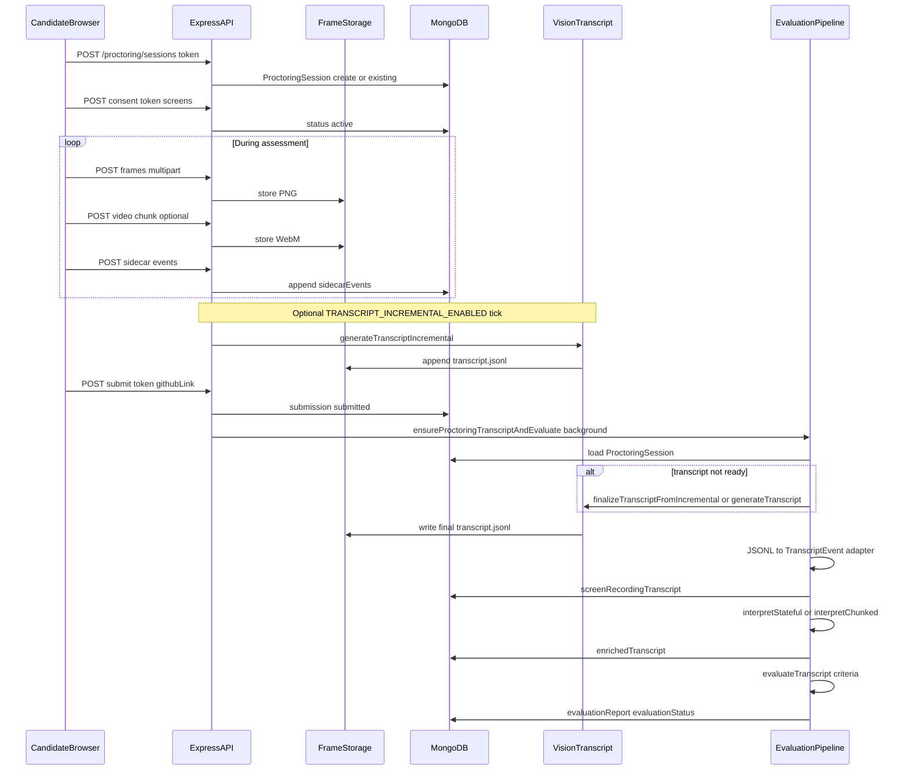

# Screen recording and transcript analysis (assessment flow)

## 1. Scope

This document describes how **BridgeAI** records a candidate’s screen during a take-home assessment, stores **frames** and **screen-capture video**, produces a **raw visual transcript** (JSONL from vision/OCR), optionally builds an **incrementally updated transcript** during the session, and—after submit—runs **transcript-based evaluation** (criteria scores, session summary) plus optional **behavioral enrichment** for the employer UI.

It is grounded in: [server/src/models/proctoringSession.ts](../server/src/models/proctoringSession.ts), [server/src/controllers/proctoring.ts](../server/src/controllers/proctoring.ts), [server/src/ai/transcript/generator.ts](../server/src/ai/transcript/generator.ts), [server/src/controllers/submission.ts](../server/src/controllers/submission.ts) (`ensureProctoringTranscriptAndEvaluate`), [server/src/services/evaluation/](../server/src/services/evaluation/), and the candidate UI in [client/src/pages/CandidateAssessment.jsx](../client/src/pages/CandidateAssessment.jsx) + [client/src/api/proctoring.ts](../client/src/api/proctoring.ts).

---

## 2. End-to-end flow (candidate assessment)

---

## 3. Data model: `ProctoringSession`

One session per submission ([proctoringSession.ts](../server/src/models/proctoringSession.ts)):

- **Identity**: `submissionId`, candidate `token`, `status` (`pending` → `active` → `completed` / `failed`).
- **Consent**: `consent.granted`, timestamps, screen count.
- **Frames**: array of `{ storageKey, screenIndex, capturedAt, dimensions, isDuplicate, clientHash }`.
- **Sidecar events**: `tab_switch`, `window_blur`/`focus`, clipboard, `url_change`, idle, `stream_lost`/`restored`, etc.
- **Transcript**: `status` (`not_started` | `generating` | `completed` | `failed`), `storageKey` (e.g. `{sessionId}/transcript.jsonl`), `generationId`, progress fields, token usage, optional **refined** transcript fields, `lastIncrementalAt` for sliding-window runs.
- **Video**: `videoChunks[]` with `storageKey`, `screenIndex`, `startTime`/`endTime`.
- **Stats**: frame counts, dedup, capture window, optional `videoStats.durationSeconds`.

---

## 4. Candidate client: capture and upload

In **[CandidateAssessment.jsx](../client/src/pages/CandidateAssessment.jsx)** (simplified):

1. **Session**: `createProctoringSession(token)` → `POST /api/proctoring/sessions`.
2. **Consent**: user accepts; `grantConsent(sessionId, token, screens)` → `POST .../consent`; session becomes `active`.
3. **Screen share**: `useScreenCapture` / multi-monitor; optional **companion** voice (ElevenLabs) and **video** recorders (`createVideoRecorder`, `uploadVideoChunk`).
4. **Screenshots**: `useScreenshotCapture` at an interval; `useFrameDedup` client-side; `useFrameUpload` batches PNGs to `POST /api/proctoring/sessions/:sessionId/frames` with `token` in form data ([uploadFrame](../client/src/api/proctoring.ts)).
5. **Sidecar**: blur/focus/copy/paste etc. → `POST .../events`.
6. **Complete**: on assessment end, `completeSession` marks session completed (and stops capture).

API surface for candidates is **token-based** (no Firebase); employer endpoints use auth.

---

## 5. Server: storing frames and video

- **[storeFrame](../server/src/services/capture/frameStorage.ts)** (via [uploadFrame](../server/src/controllers/proctoring.ts)): validates token/session, dedup (server hash), writes blob under storage prefix (local or S3-ready abstraction), updates `session.frames` and `stats`.
- **Video chunks**: separate multipart upload path; `storeVideoChunk` appends `videoChunks` and stats.

Storage layout is implementation-specific to `getFrameStorage()`; local dev often uses `PROCTORING_STORAGE_DIR` (see [CLAUDE.md](../CLAUDE.md) env section).

---

## 6. Raw transcript generation (vision pipeline)

**Entry points**

- **Full run**: [generateTranscript(sessionId)](../server/src/ai/transcript/generator.ts) — used by employer-triggered `POST .../generate-transcript` and by submit-time pipeline when transcript is missing/failed and incremental finalization is not used.
- **Incremental**: [generateTranscriptIncremental](../server/src/ai/transcript/generator.ts) — processes frames with `capturedAt >= sinceMs`, merges into existing JSONL; does **not** set `transcript.status` to `completed` (used during live session).
- **Finalize**: `finalizeTranscriptFromIncremental` (referenced from [submission.ts](../server/src/controllers/submission.ts)) — completes/merges incremental output when submit runs.

**Pipeline steps** (orchestrator in [generator.ts](../server/src/ai/transcript/generator.ts)):

1. **Prepare**: [prepareSessionForTranscript](../server/src/services/capture/framePrep.js) loads frame buffers + sidecar events for the session.
2. **Mode A — prompt-only** (default): batches of full-frame PNGs → OpenAI vision ([analyzeFrameBatch](../server/src/ai/transcript/visionClient.ts)) with system prompt [PROMPT_TRANSCRIPT_SYSTEM](../server/src/prompts/index.ts) (JSONL per region: `ts`, `ts_end`, `screen`, `region`, `app`, `text_content`).
3. **Mode B — region detection** (`TRANSCRIPT_REGION_DETECTION` not `false`): [detectRegions](../server/src/ai/transcript/regionDetector.ts) → crop panels → per-region OCR ([ocrEngine](../server/src/ai/transcript/ocrEngine.ts) may use Tesseract then vision fallback) with [REGION_PROMPTS](../server/src/prompts/regionPrompts.ts).
4. **Stitch**: [stitchBatchOutputs](../server/src/ai/transcript/stitcher.js) merges batch outputs chronologically.
5. **Sidecar**: [injectSidecarEvents](../server/src/ai/transcript/manifestInjector.js) weaves blur/focus/etc. into the JSONL narrative where applicable.
6. **Persist**: write JSONL via storage `putTranscript`, update session `transcript.storageKey`, `status`, token usage, `generationId` race-safety.

**Incremental scheduler**: If `TRANSCRIPT_INCREMENTAL_ENABLED=true`, [startIncrementalScheduler](../server/src/ai/transcript/incrementalScheduler.ts) is started from [server.ts](../server/src/server.ts); on an interval it runs `generateTranscriptIncremental` for each **active** session whose transcript is not `generating`.

---

## 7. After submit: transcript + evaluation (background)

When the candidate submits GitHub link, [submitSubmissionByToken](../server/src/controllers/submission.ts) (and legacy submit path) fires **ensureProctoringTranscriptAndEvaluate(submissionId)** without blocking the HTTP response.

That function:

1. Loads submission + **assessment** with `evaluationCriteria`; fails evaluation if no criteria or no proctoring session.
2. If transcript is **generating**, polls until completed/failed (bounded wait).
3. If **not_started** or **failed**: either **finalizeTranscriptFromIncremental** (if `storageKey` + `lastIncrementalAt` exist) or **generateTranscript**.
4. Loads transcript via **[getProctoringTranscriptForSubmission](../server/src/services/evaluation/proctoringTranscriptAdapter.ts)** (reads JSONL from storage).
5. Converts JSONL → **TranscriptEvent[]** with **proctoringJsonlToTranscriptEvents** (seconds since session start, inferred `action_type`, `ai_tool` from app name).
6. Saves **screenRecordingTranscript** on the submission document.
7. **Optional enrichment**: loads raw JSONL again, **jsonlToScreenMoments** → **interpretChunked** or **interpretStateful** per `INTERPRETER_STRATEGY` (default `stateful`); saves **enrichedTranscript** on submission.
8. Runs **evaluateTranscript** ([orchestrator.ts](../server/src/services/evaluation/orchestrator.ts)): parallel per-criterion **validate → ground (or use cached groundings) → retrieve relevant events → LLM score**, plus **generateSessionSummary**; writes **evaluationReport** and **evaluationStatus**.

---

## 8. Evaluation artifacts (employer-facing)

- **evaluationReport**: `session_summary` + `criteria_results[]` (scores, evidence with `ts`/`ts_end` in seconds, verdicts).
- **enrichedTranscript**: `session_narrative`, `events[]` (behavioral summaries, intents, AI tool), `strategy`, `processing_stats`.
- **Raw JSONL** remains in storage at `transcript.storageKey`; employer UI may fetch via `GET /api/proctoring/sessions/:sessionId/transcript` (auth rules per route).

**Video playback**: remuxed WebM from chunks — `GET .../playback-video` with assessment-owner check ([getPlaybackVideo](../server/src/controllers/proctoring.ts)).

---

## 9. Environment variables (high-signal)

Documented in [CLAUDE.md](../CLAUDE.md) under proctoring/transcript; notably:

- `TRANSCRIPT_GENERATION_ENABLED`, `TRANSCRIPT_REGION_DETECTION`, `TRANSCRIPT_BATCH_SIZE`, `TRANSCRIPT_BATCH_CONCURRENCY`, `OPENAI_VISION_MODEL`, `TRANSCRIPT_INCREMENTAL_ENABLED`, `TRANSCRIPT_INCREMENTAL_INTERVAL_MS`, `INTERPRETER_STRATEGY`, `PROCTORING_STORAGE_DIR`, frame interval / dedup / layout envs.

---

## 10. Failure modes (operational)

- No **proctoring session** → evaluation fails with message that candidate must complete with proctoring.
- **Zero frames** → transcript generation throws; evaluation fails.
- **Transcript generation disabled** → `TRANSCRIPT_GENERATION_DISABLED` error path.
- **Interpretation** failure is logged; evaluation still proceeds from raw transcript adapter output.

---

## Related docs

- [RAW_TRANSCRIPT_PROCESSING.md](./RAW_TRANSCRIPT_PROCESSING.md) — raw JSONL format and interpreter strategies.
- [PIPELINE_DEBUG_PROCTORING_TO_EVALUATION.md](./PIPELINE_DEBUG_PROCTORING_TO_EVALUATION.md) — debugging the path to evaluation.
- [TRANSCRIPT_AND_CRITERIA_EVALUATION.md](./TRANSCRIPT_AND_CRITERIA_EVALUATION.md) — criteria evaluation details.
